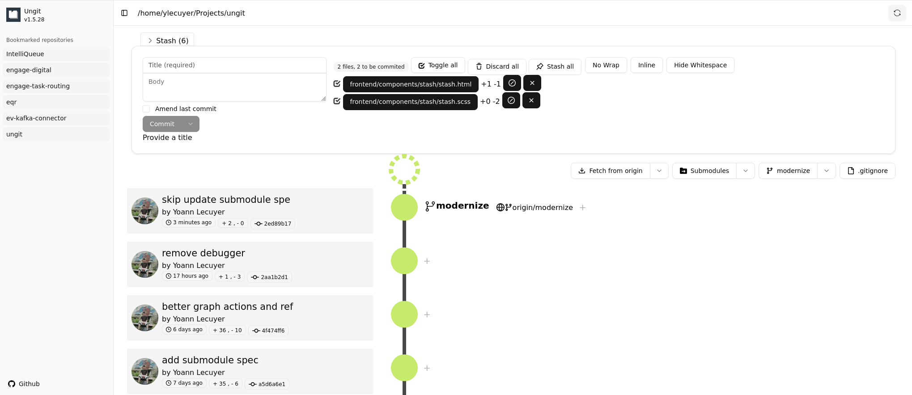

Fork
====

Fork of [https://github.com/FredrikNoren/ungit](https://github.com/FredrikNoren/ungit)

Changes:
 * Modernized UI
 * Simplfied frontend/backend code



Configuring
-----------
Put a configuration file called .ungitrc in your home directory (`/home/USERNAME` on \*nix, `C:/Users/USERNAME/` on windows). Configuration file must be in json format. See [source/config.js](source/config.js) for available options.

You can also override configuration variables at launch by specifying them as command line arguments; `ungit --port=8080`. To disable boolean features use --no: `ungit --no-autoFetch`.

Example of `~/.ungitrc` configuration file to change default port and enable bugtracking:

```json
{
	"port": 8080,
	"bugtracking": true
}
```

Changelog
---------
See [CHANGELOG.md](CHANGELOG.md).

License (MIT)
-------------
See [LICENSE.md](LICENSE.md).